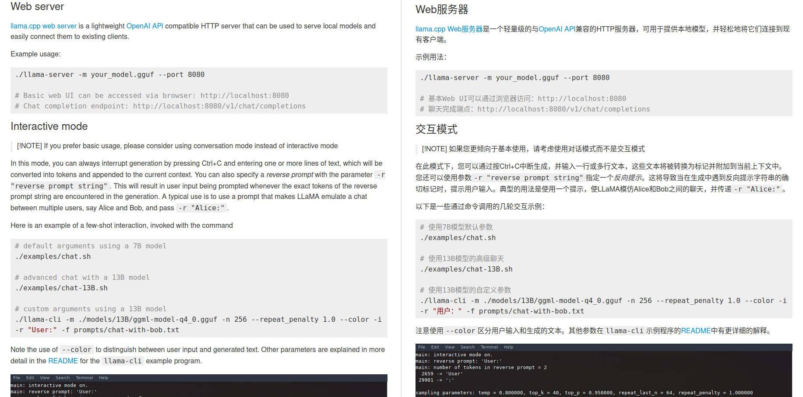

# CppLLMTranslate

使用Cpp实现的基于大语言模型的翻译软件 

---

---

## 翻译效果

一下是对llama.cpp项目的README.md的翻译效果

可以看到翻译效果还是不错的

---

---

## 功能介绍

---

### 支持的模型

该项目使用openai接口进行推理翻译，只要是支持openai接口都可以使用

支持本地部署的openai接口或者其他付费商用大模型openai接口

---

#### 本地部署大模型推理openai接口

本地推荐使用ollama进行部署，启用openai接口

也可以通过编译llama.cpp项目运行server启用openai接口进行本地推理

英汉互译建议使用：

电脑配置好：
- gemma-2-9b-it
- mistral-nemo 

电脑配置一般：
- gemma-2-2b-it

---

#### 调用商用大模型openai接口

商用大模型推荐使用glm-4-flash

智谱免费开放了glm-4-flash的接口推荐使用

收费的大模型推荐使用deepseek-coder
价格便宜，效果不错

---

### 拷贝翻译功能

- 默认支持中文和英文的互译(其他语言需要自行修改提示词与优质翻译，模型会根据提示词和优质翻译的格式进行翻译)
- 默认打开拷贝翻译，即拷贝文字后自动出现在输入框中，点击提交按钮进行翻译
- 支持剪贴板替换功能，即点击翻译按钮后，将翻译结果替换剪贴板中的内容

---

### 批量文件翻译功能

- 默认支持英文翻译为中文，其他语言需要自行修改提示词与优质翻译，模型会根据提示词和优质翻译的格式进行翻译
- 目前支持的文件格式为 (不在列表中的文件格式不会进行翻译)
    - .md
    - .txt
    - .rst
    - .h
- 会根据不同文件后缀进行文件切割，再根据设定的段落长度提交给模型进行翻译
- 翻译结束后会在设定目录生成同名翻译文件，包括对照翻译文件和翻译文件

---

---

## 使用说明

---

### 连接openai接口页面

- 在设置页面中可以设置openai的接口地址和key，以及模型名称
- 设置完成点击"测试",如果连接成功会有大模型的回复，如果连接失败会有错误提示
- 点击开始按钮进入翻译页面

---

### 翻译页面

- 在功能下拉菜单中选择模式
- 在输入框中输入需要翻译的内容，点击提交按钮进行翻译
- 点击"繁"或"简"进行切换，在"繁"页面可以进行提示词与优质翻译的修改，当需要翻译其他语言时，或者决定翻译效果不佳时，可以修改提示词与优质翻译
- (Ctrl 加 Enter) 组合键也可以提交 
- (Ctrl 加 +)字体变大 (Ctrl 加 -)字体变小

---

### 批量文件翻译页面

- 在下拉菜单中选择"文件翻译"模式
- 在"进度"页面修改文件的输入输出路径（默认为文件运行路径下的/input和output文件夹）
- 在"进度"页面点击"切割"按钮，将文件切割成段落，可以在输出文件路径查看切割后的文件，确认是否符合要求，可手动修改切割标记以修改切割文件
- 在"进度"页面修改段落切割长度
    - 代码会根据切割标记将待翻译文本切割成段落，然后将每个段落进行拼接提交给模型进行翻译
    - 当小于"段落有效值"时，继续拼接下一个段落
    - 当大于"段落有效值"小于"段落最小值"时，使用第一个切割标记进行拼接翻译
    - 当大于"段落最小值"时，小于"段落最大值"时，使用找到的英文句号进行拼接翻译
    - 当大于"段落最大值"时，找到换行进行拼接翻译
- 当发现翻译效果不佳时，可以减小"段落有效值"、"段落最小值"和"段落最大值"的值，避免过长的文本影响翻译效果，注意要小于模型支持的上下文长度
- 当发现翻译效果不佳时，点击"提示"可以修改提示词与优质翻译
- 目前支持的文件格式为（不在列表中的文件格式不会进行翻译）
    - .md
    - .txt
    - .rst
    - .h
- 可以在"提示"页面修改不同文件格式的提示词与优质翻译
- 当未翻译完成退出软件，可以再次打开软件，点击"提交"按钮，继续翻译未完成的文件
- 当需要翻译新的文件时，可以点击“清理文件按钮”开始新的翻译任务

---

---

## 编译环境要求

使用QT6进行开发，使用Cmake进行项目管理和构建
直接使用 Qt creator 进行编译即可

---

---

